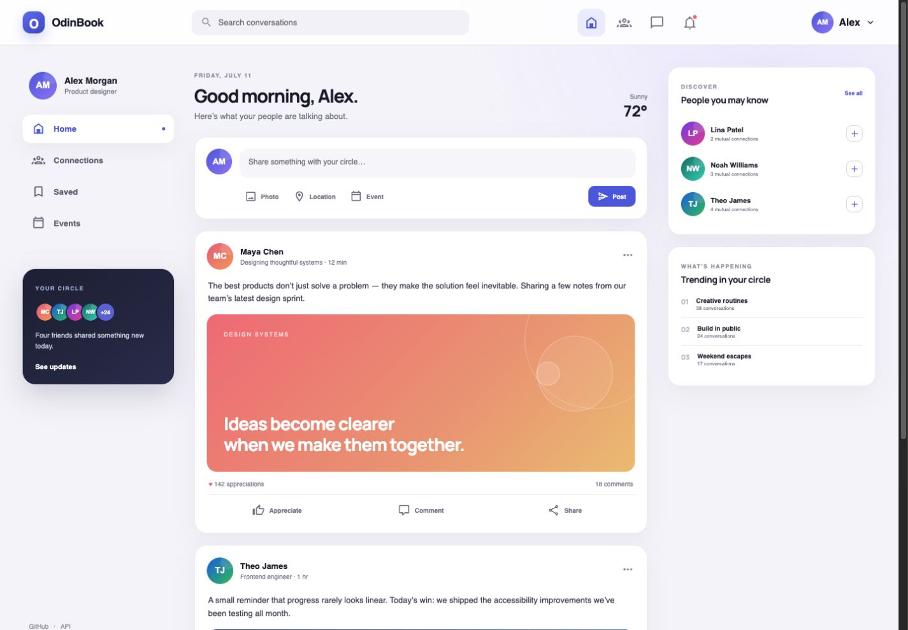
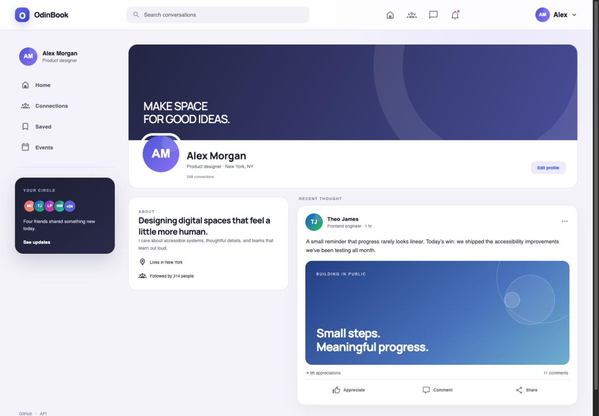
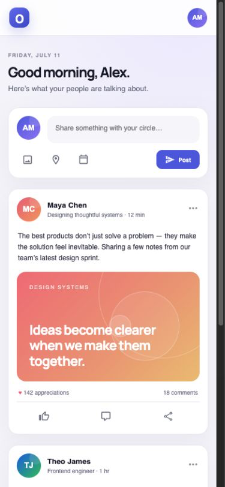

# OdinBook

A full-stack social network for sharing updates, keeping up with friends, and building a personal profile. The refreshed interface pairs the original MERN feature set with a calmer, more editorial visual system and a responsive layout built for modern screens.

[Live app](https://lustrous-dodol-b9be51.netlify.app/) · [Server repository](https://github.com/whuang1101/OdinBook-server)



## A closer look

| Profile | Mobile feed |
| --- | --- |
|  |  |

## Highlights

- Create, edit, and delete posts
- Like and comment on friends’ updates
- Send and accept friend requests
- Browse a friends-only timeline
- Build a profile with a photo, bio, and recent activity
- Use a demo account without creating a new login
- Stay signed in with secure, server-managed sessions
- Navigate responsive layouts on mobile, tablet, and desktop
- See loading skeletons and animated interaction feedback

## Design showcase

The app includes an opt-in showcase mode with local faux data for repeatable design review, portfolio captures, and frontend development without mutating production content.

```text
http://localhost:5173/?demo=1
http://localhost:5173/?demo=1&view=profile
http://localhost:5173/?demo=1&view=friends
```

Showcase mode is presentation-only. The standard routes continue to use the real API, authentication, posts, comments, likes, friendships, and profiles.

## Tech stack

- React 18 and React Router
- Redux Toolkit
- Framer Motion
- Material Design Icons
- Vite
- Node.js, Express, MongoDB, Passport, and bcrypt on the [API](https://github.com/whuang1101/OdinBook-server)

## Local development

```bash
git clone https://github.com/whuang1101/OdinBook.git
cd OdinBook
npm install
npm run dev
```

Vite will print the local URL, usually `http://localhost:5173`.

## Scripts

```bash
npm run dev      # Start the development server
npm run build    # Create a production build
npm run preview  # Preview the production build
npm run lint     # Run ESLint
```

## Related work

- [Keep In Touch](https://github.com/whuang1101/KeepInTouch) — real-time messenger clone
- [OdinBook API](https://github.com/whuang1101/OdinBook-server) — REST API and authentication service

Built by [Wilson Huang](https://github.com/whuang1101).
